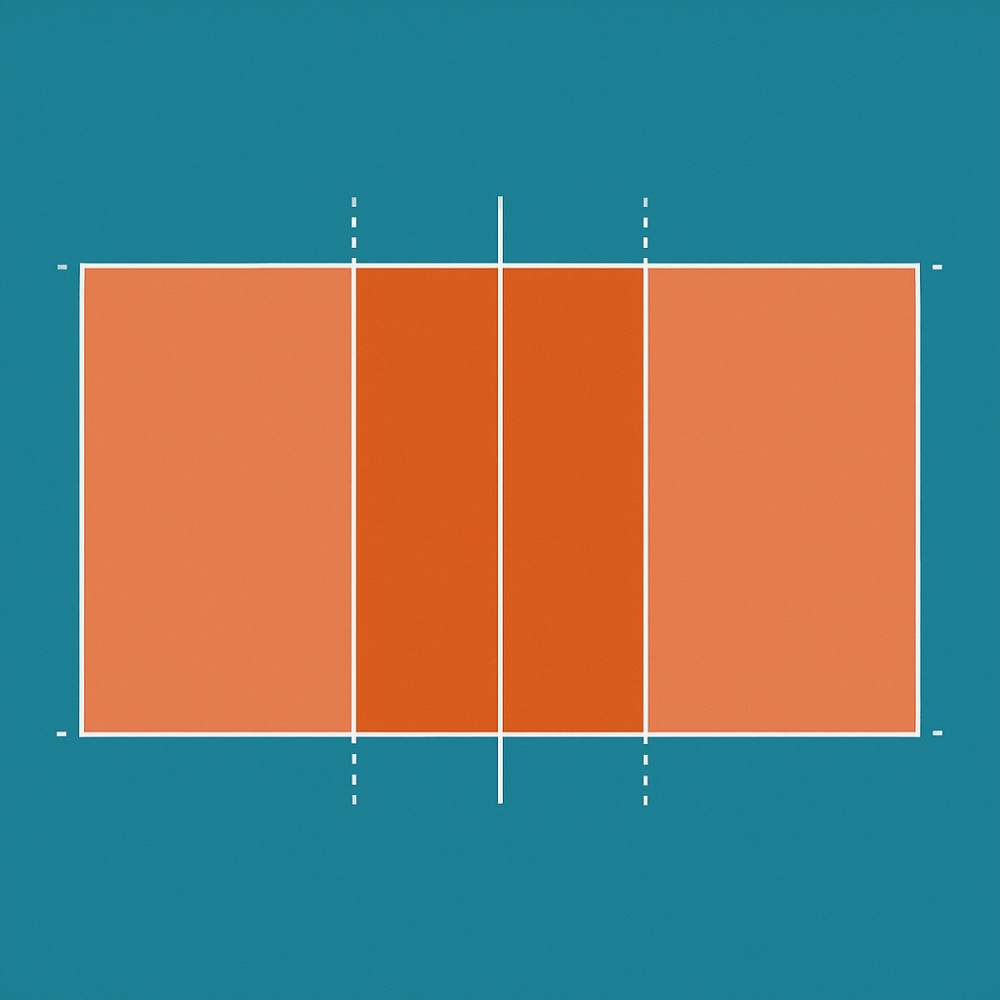

# 相關社群
* Facebook

    

        
        

            <a href="https://www.facebook.com/groups/184726534871845/">去看看</a>
        

    

* Line

    

        
        

            <a href="https://line.me/ti/g2/-XnJE482hQ5AWfFBLYuysMKDS4m4TbOMbhJaFw?utm_source=invitation&utm_medium=link_copy&utm_campaign=default">點擊加入</a>
        

    

# 排球小遊戲
## 大人版
1. 連續低手接球過程中穿好一件衣服，只能低手不能上手，衣服完整正面穿好、下擺拉齊才算成功，球落地就算失敗，一次機會

    

2. 發球打倒對面的滿水寶特瓶，球落地後再撞倒也算成功，三次機會
3. 扣球打倒對面的滿水寶特瓶，球落地後再撞倒也算成功，兩次機會
4. 舉球打倒隔網對角的空瓶寶特瓶，可以上手或下手但不可扣球，球落地後再撞倒不算成功，兩次機會

## 小孩版
1. 滾球或踢球擊倒三個空瓶寶特瓶，6歲以上兩次機會，未滿的三次機會；成功獎品在$50內，要有安慰獎(貼紙)
